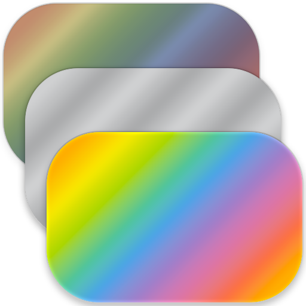
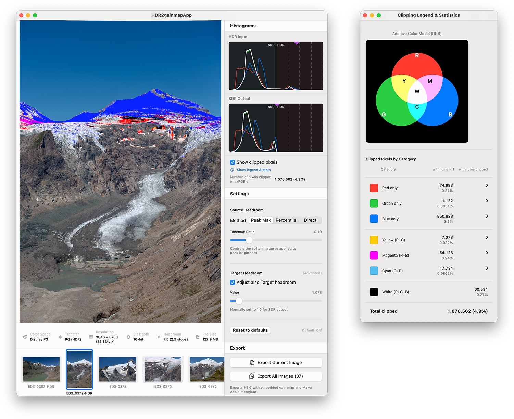
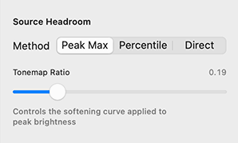
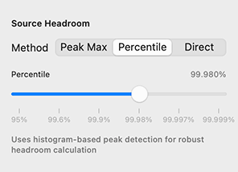
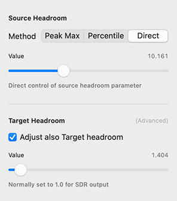

<p align="center">
  
</p>

# HDR2gainmap App

A native macOS application for **converting HDR PNG images** (Display P3 PQ) to **HEIC with embedded gain maps**, providing full creative control over the SDR tone-mapping process while ensuring **seamless compatibility across the Apple ecosystem**.



## Overview

HDR2gainmap App is a SwiftUI-based graphical frontend for converting pure (i.e. gainmap-less) HDR images into Apple-compatible HEIC files **with gain maps**. Unlike automated conversion tools, this application gives you **full creative control** over how your HDR content is tone-mapped to SDR, allowing you to craft the perfect base SDR image for devices that don't support HDR, while preserving the full HDR experience for compatible displays thanks to the presence of the gain map.

The resulting HEIC files work seamlessly (i.e. **the SDR or the HDR version of the image will be displayed correctly based on the user's display capability**) across:

- **all Apple ecosystem**:
	- macOS (Photos, Preview, Safari, QuickLook)
	- iOS and iPadOS (Photos, Files, Safari)
	- iCloud Photo Library (sync will not result in stripping of gain maps as is the case with other methods!)
	- Any app that uses Apple's native image rendering pipeline
- non-Apple software: any software implementing ISO 21496 specification for gain maps (e.g. **most browsers at the time of writing**)

### Key Features

- **Three tone-mapping control methods** for precise control over SDR rendering (more info below):
  - **Peak Max**: Most intuitive, high-level control
  - **Percentile**: Lets you control directly how many pixels will be clipped in the final SDR image
  - **Direct**: Low-level control allowing you to manually select source / target headroom specification
- **Real-time preview** with optional clipped pixel overlay (multi-color visualization highlighting which channels are being clipped)
- **Live HDR and SDR histograms** with split-axis layout (sRGB curve for SDR, logarithmic for HDR)
- **Detailed clipping statistics** with interactive legend window
- **Batch export** with progress tracking
- **Metal-accelerated** histogram and peak luminance calculation

## Input Format Requirements

The application accepts **HDR PNG files** with the following specifications:

- **Color Space tag**: Display P3 with PQ (Perceptual Quantizer / ST.2084) transfer function
- **Bit Depth**: 16-bit per channel (required for PQ encoding)
- **Channels**: RGB or RGBA
- **File Extension**: `.png`

### Verifying Your HDR PNGs

You can verify your HDR PNG files using macOS command-line tools:
```bash
sips -g all your_image.png | grep -E "space|profile"
```

Expected output should contain `Display P3 PQ` or similar PQ-based color space identifier.

## How It Works

### 1. Tone-Mapping (HDR → SDR Base Image)

The application uses Apple's `CIToneMapHeadroom` filter from Core Image to generate the SDR base image. This filter accepts two key parameters:

- **Source Headroom**: The relative headroom of the input HDR image (ratio of peak luminance to reference HDR paper white, typically 203 nits)
- **Target Headroom**: The desired headroom for the output (1.0 for standard SDR)

#### Tone-Mapping Methods

**Peak Max [applies to Source Headroom only]**



- Derives source headroom using the formula: `1 + measuredHeadroom - measuredHeadroom^ratio`
- The slider controls the `ratio` parameter (0.0 = no compression, 1.0 = full compression to SDR)
- Provides intuitive creative control over highlight roll-off

**In a nuthsell:** drag to the left limit to 'crunch' all pixels into the SDR space / drag to the right limit to leave pixels as they are, ending up with all original pixels brither than standard white HDR being clipped in the final SDR image)

**Percentile [applies to Source Headroom only]**



- Builds a cumulative distribution function (CDF) from the image's luminance histogram
- Derives source headroom from a user-selected percentile (e.g., 99.9% = top 0.1% of pixels)
- Robust against outliers and specular highlights
- Uses a non-linear slider mapping for precise control in the 95-99.999% range

**In a nutshell:** lets you specify the percentage of pixels that should result as clipped in the final SDR image. Drag to the left limit to force 0.001% of pixels clipped, drag to the right limit to force 5% of pixels clipped.

**Direct [applies to both Source and Target Headroom]**



- Exposes the raw `CIToneMapHeadroom` parameters directly
- Source headroom: defaults to measured peak luminance
- Target headroom: defaults to 1.0 (standard SDR), can be adjusted for creative effects
- Useful for matching specific technical requirements or recreating known tone curves

**In a nutshell:** this control allowing you to manually select source / target headroom specification

### 2. Gain Map and Apple Metadata Generation

After tone-mapping, the application:

1. Generates a temporary in-memory HEIC file containing both the SDR base image and the original HDR image
2. Extracts the **gain map** from the temporary file using Core Image's `auxiliaryHDRGainMap` option
3. The gain map encodes the per-pixel ratio between HDR and SDR values
4. To ensure full compatibility with Apple's HDR rendering pipeline, the application computes and embeds **Maker Apple metadata** (MakerNote tags 33 and 48) based on the derived source headroom: basically, what it does is inverting the calculation of headroom based on metadata [as documented by Apple](https://developer.apple.com/documentation/appkit/applying-apple-hdr-effect-to-your-photos).
5. Finally, the app prepares the final HEIC file by baking together
	- the base SDR image, prepared according to your taste
	- the tone map, making the image displayable as the original HDR on proper displays
	- Apple Metadata, providing full Apple compatibility

### 3. Final Export

The application writes the final HEIC file using:

- `CIContext.writeHEIFRepresentation()` (default) or
- `CIContext.writeHEIF10Representation()` (macOS 14+, selectable in Preferences, try switching to this mode if the default one fails)

Export quality is configurable (default: 0.97) via the Preferences window.

## Metal Acceleration

The application leverages Metal compute shaders for performance-critical operations:

- **Histogram calculation**: 10-50× faster than CPU implementation
- **Peak luminance detection**: 10-100× faster than CPU implementation
- **Percentile CDF generation**: Cached for real-time slider response

Metal acceleration is automatically detected and enabled when available, with graceful CPU fallback.

## System Requirements

- **macOS 15.x** (Sequoia) or later
- **Tested on**: Intel-based Mac running macOS 15.x
- **Apple Silicon**: Please test and report back!


## Verifying Output

To verify that your exported HEIC files contain valid gain maps and render correctly in HDR:

1. **Use Adobe's Gain Map Demo App**:  
   Download from [here](https://www.adobe.com/go/gainmap_demoapp_mac) and check for your output images to be reported as an "SDR photo with a Gain Map". Pressing ⌘+I should also report "Gain Map Type: Apple"

2. **Test in Apple Photos**:
   - Import the HEIC file into Photos.app
   - View on an HDR-capable display (MacBook Pro with XDR display, Pro Display XDR, etc.)
   - The image should render with HDR highlights when viewed in Photos

3. **Test iCloud Sync**:
   - Add to iCloud Photo Library
   - Verify the image syncs and displays correctly on iPhone 12 or later (HDR display required)

## Building from Source

### Prerequisites

- Xcode 16.0 or later
- macOS 15.0 SDK or later

### Clone and Build
```bash
git clone https://github.com/vastunghia/HDR2gainmapApp.git
cd HDR2gainmapApp
open HDR2gainmapApp.xcodeproj
```

Build and run using Xcode (⌘R).

## Technical Details

### Histogram Implementation

The application uses a **split-axis histogram** approach:

- **SDR region** (0 to reference white ≈ 203 nits): Maps luminance values using an sRGB-shaped curve
- **HDR region** (reference white to maximum headroom): Maps luminance values logarithmically in stops

This provides optimal resolution for both SDR and HDR ranges within a compact visualization.

Bin edges are computed to ensure the last SDR bin width approximately matches the first HDR bin width, creating a visually continuous transition at the reference white boundary.

### Clipping Visualization

The overlay uses a **multi-color scheme** to identify which channels are clipped:

- **Primary colors** (Red, Green, Blue): Single channel clipping
- **Secondary colors** (Yellow, Magenta, Cyan): Two-channel clipping
- **Dim variants** (50% intensity): Channel clipping with luminance ≥ 1.0
- **Black**: All three channels clipped (maxRGB > 1.0)

This allows precise diagnosis of clipping issues across the color gamut.

### Caching Strategy

The application implements multiple cache layers for performance:

- **CIImage cache**: Loaded HDR images (stored in linear Display P3)
- **Raw pixel data cache**: 16-bit PQ samples for histogram/headroom calculation
- **Preview cache**: Separate caches for base SDR and overlay variants
- **Percentile CDF cache**: Pre-computed lookup tables for real-time slider response
- **Metadata cache**: Image headers to avoid redundant disk I/O

## License

MIT

## Contributing

Contributions are welcome! Please feel free to submit a Pull Request.

## Acknowledgments & Related Projects

- Originally inspired by the [work of **chemharuka**](https://github.com/chemharuka/toGainMapHDR)
- Built upon my experience with the development of [a similar CLI tool](https://github.com/vastunghia/HDR2gainmap)
- Most parts of the code were written by Claude Sonnet 4.5 and a few by ChatGPT 5.x, under my guidance

## Support

For issues, questions, or feature requests, please open an issue on GitHub.

---

**Note**: This application is an independent project and is not affiliated with, endorsed by, or supported by Apple Inc. or Adobe Inc.
