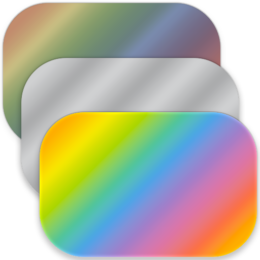
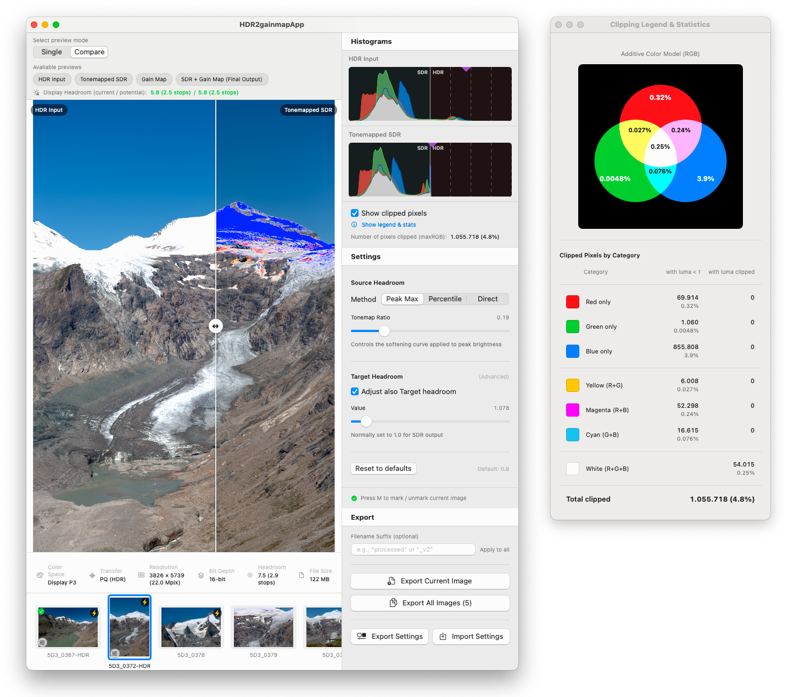
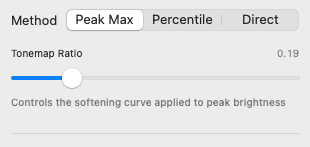
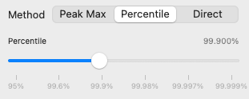
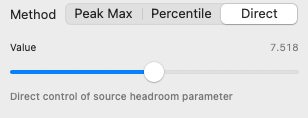

<p align="center">
  
</p>

<h1 align="center">HDR2gainmap App</h1>

<p align="center">
  <b>Take full creative control of your HDR photos and export them as gain-map HEICs that look right everywhere — iPhone, Mac, iCloud, and the web.</b>
</p>

<p align="center">
  <a href="https://github.com/vastunghia/HDR2gainmapApp/releases/latest"></a>
  <a href="https://github.com/vastunghia/HDR2gainmapApp/releases"></a>
  
  <a href="LICENSE"></a>
</p>

<p align="center">
  <a href="https://github.com/vastunghia/HDR2gainmapApp/releases/latest"><b>⬇️ Download the latest release</b></a>
</p>



## The problem

Modern Apple devices and most web browsers can show **true HDR photos** using a *gain map*: an SDR
base image plus a recipe to reconstruct the HDR rendition on capable displays. The catch is getting
there. Export HDR from your editor and you typically end up with one of two bad outcomes — a flat SDR
file that throws away your highlights, or an HDR file whose gain map gets **stripped the moment it
syncs through iCloud** or opened by non-Apple software.

**HDR2gainmap App** closes that gap. It takes a pure HDR file — a 16-bit PNG or TIFF with a PQ/HLG transfer — and writes a
**HEIC with an embedded, standards-based gain map** — the same ISO 21496-1 format Apple itself writes
for native HDR captures. Crucially, it gives you **full creative control over how the HDR is
tone-mapped to the SDR base**, so the photo looks exactly how you want it on *both* HDR and SDR
displays — and survives iCloud sync intact.

This is the tail end of a real photographer's workflow: **shoot RAW → edit in HDR (e.g. Lightroom) →
export an HDR PNG/TIFF → HDR2gainmap App → a gain-map HEIC you can drop straight into your iCloud library.**

## Who is it for

- **Photographers shooting and editing in HDR** (Lightroom HDR and similar) who want their work to
  display as true HDR across their devices.
- **Anyone in the Apple ecosystem** who needs HDR photos that sync through iCloud without losing the
  gain map, and render correctly in Photos, Preview, Safari, and QuickLook.
- **People who care about cross-platform compatibility** — output also works in standards-compliant
  non-Apple software (most modern browsers) thanks to ISO 21496-1 gain maps.
- **Anyone who wants the SDR base to look good**, not just the HDR — with precise, visual control
  over tone-mapping instead of a black-box automatic conversion.

## Highlights

- **🎛️ Full creative control of the SDR base** — three tone-mapping methods (Peak Max, Percentile,
  Direct) let you decide exactly how HDR highlights roll off into SDR, instead of accepting whatever
  an automatic converter produces.
- **👁️ See every stage, live** — a multi-view preview switches between **HDR Input**, **Tonemapped
  SDR**, **Gain Map**, and **SDR + Gain Map (Final Output)**, all updating in real time as you drag
  the sliders. A draggable **comparison slider** wipes between any two views.
- **🌟 True HDR (EDR) preview** — on HDR-capable displays, highlights are shown with real headroom,
  with a live readout of how much display headroom you currently have (in stops).
- **📦 Standards-based, sync-safe output** — **ISO 21496-1 gain maps** recognized across the Apple
  ecosystem *and* by standards-compliant non-Apple software, with original metadata preserved.
- **📊 Lightroom-style histograms** — split-axis HDR/SDR histograms with always-on clipping
  statistics and an interactive clipping legend.
- **🗂️ Batch-friendly** — batch export with progress tracking, plus exportable/importable
  per-image "develop" settings profiles to resume work or share a look across machines.


## Full feature list

<details>
<summary><b>Preview &amp; inspection</b></summary>

- **Multi-view preview**: switch the preview between four live views — **HDR Input**, **Tonemapped
  SDR**, **Gain Map**, and **SDR + Gain Map (Final Output)** — to inspect the HDR source, your SDR
  base, the gain map itself, and the *actual reconstructed export* before you write a single file.
- **True HDR (EDR) preview** on HDR-capable displays, with a live **Display Headroom (current /
  potential)** readout in stops, so you can judge highlights as they will really appear.
- **Image comparison slider**: place any two of the four views side by side with a draggable divider
  (e.g. *HDR Input* vs *Final Output*) to spot differences directly.
- **Pixel-peeping zoom** (100 % / 200 % / 400 %, configurable) with click-to-zoom and drag-to-pan,
  available in every view.
- **Real-time clipped-pixel overlay** (multi-color visualization highlighting which channels are
  being clipped).
- **Live HDR and SDR histograms** with a Lightroom-style split-axis layout (sRGB curve for SDR,
  logarithmic for HDR) and an always-on clipping readout.
- **Detailed clipping statistics** (always shown, including the count of clipped pixels by maxRGB)
  with an interactive legend window.

</details>

<details>
<summary><b>Tone-mapping control</b></summary>

- **Three tone-mapping control methods** for precise control over SDR rendering (more info below):
  - **Peak Max**: Most intuitive, high-level control.
  - **Percentile**: Lets you control directly how many pixels will be clipped in the final SDR image.
  - **Direct**: Low-level control allowing you to manually select source / target headroom.

</details>

<details>
<summary><b>Output &amp; metadata</b></summary>

- **ISO 21496-1 compliant gain maps** — the standards-based format Apple itself writes for native HDR
  captures, recognized both across the Apple ecosystem and by standards-compliant non-Apple software.
- **Configurable gain map resolution** (half ½× by default, like Apple's native captures, or full 1×).
- **Metadata preserved** in output files.

</details>

<details>
<summary><b>Workflow &amp; navigation</b></summary>

- **Batch export** with progress tracking and the option to append a string of your choice to all
  file names.
- **Export / import development settings**: save the per-image tone-mapping "develop" settings of a
  whole folder to a portable JSON profile and re-apply them later — ideal for resuming work or sharing
  a look across machines (only images you actually customized are stored; any images listed in the
  profile but missing from the folder are reported on import).
- **Fast thumbnail navigation**: browse images from the bottom thumbnail bar, or move to the
  previous/next image with the **←/→ arrow keys** (the selected thumbnail scrolls into view).
- **Thumbnail status badges**: a **"settings modified"** badge flags thumbnails whose tone-mapping
  differs from the defaults, and a user-toggled **"ready for export"** flag (press the **M** key on
  the current image) lets you mark the shots you have finished — the flag is persisted in the
  settings profile.
- **"In memory" indicator**: a small ⚡️ lightning-bolt badge marks the thumbnails whose pixels are
  currently resident in memory (and will therefore load instantly); it updates live as images are
  cached and as older ones are evicted.

</details>

<details>
<summary><b>Performance</b></summary>

- **Background pre-loading**: when you select an image, its neighbours (next and previous) are warmed
  in the background so sequential browsing feels near-instant — without slowing down work on the
  current image.
- **Metal-accelerated** histogram and peak luminance calculation.

</details>

Where does the output work?

- **Across the entire Apple ecosystem** — the SDR or the HDR version is displayed correctly based on
  the viewer's display capability:
  - macOS (Photos, Preview, Safari, QuickLook)
  - iOS and iPadOS (Photos, Files, Safari)
  - iCloud Photo Library (sync will **not** strip gain maps, unlike many other methods)
  - any app that uses Apple's native image rendering pipeline
- **Non-Apple software** — any software implementing the ISO 21496 specification for gain maps (e.g.
  most browsers at the time of writing).

## Input Format Requirements

The application accepts **HDR PNG and TIFF files** with the following specifications:

- **Transfer function**: PQ (Perceptual Quantizer / ST.2084) or HLG — i.e. any ITU-R BT.2100 HDR transfer
- **Color Space**: wide-gamut (e.g. Display P3 or BT.2020); other primaries are converted automatically
- **Bit Depth**: 16-bit per channel (required for HDR encoding)
- **Channels**: RGB or RGBA
- **File Extensions**: `.png`, `.tif`, `.tiff`

The HDR transfer function is detected directly from the file's color space, so HDR images
exported by editors that embed a custom (unnamed) ICC profile are recognized too.

### Verifying Your HDR Files

You can inspect a file's color space with macOS command-line tools:
```bash
sips -g all your_image.png | grep -E "space|profile"
```

A PQ-tagged file reports a `PQ` / `ST 2084` color space. Note that some editors export genuine
HDR with a generically named profile (e.g. just `Display P3`) — these are still accepted, as the
app reads the embedded transfer function rather than relying on the profile name.

## How It Works

### 1. Tone-Mapping (HDR → SDR Base Image)

The application uses Apple's `CIToneMapHeadroom` filter from Core Image to generate the SDR base image. This filter accepts two key parameters:

- **Source Headroom**: The relative headroom of the input HDR image (ratio of peak luminance to reference HDR paper white, typically 203 nits)
- **Target Headroom**: The desired headroom for the output (1.0 for standard SDR)

#### Understanding the controls

Two parameters shape the whole result — **Source Headroom** and **Target Headroom** — and everything else (the three methods, the sliders, the Auto button) is just a way to set them.

- **Target Headroom** should be left at **1.0** in almost every case; it is not the creative control. It lives in its own *Advanced* section (off by default) and you can tweak it to push the look into extreme/creative territory, but as a rule it stays put.
- **Source Headroom** is the key control. It decides **how many pixels clip** (exceed white) in the tone-mapped SDR base — which is exactly the trade-off you are dialing in:
  - **Few clipped pixels** (at the limit, zero) → a faithful reconstruction of the image, both in the SDR base and — above all — in the HDR result (SDR + gain map), but an SDR base that may look **too dark**.
  - **More clipped pixels** → an SDR base that is **brighter** on average, but the detail in the brightest parts of the image gets distorted ("mangled") in both the SDR base and the HDR reconstruction.

The three methods below are simply three ways to arrive at a Source Headroom value; they all act on **that parameter only**. For the same resulting Source Headroom the output is identical, whichever method you used — so pick whichever feels most intuitive. (Target Headroom is set independently, in its own section.)

> The same explanation is available in-app via the **?** button next to *Source Headroom*.

#### Tone-Mapping Methods

**Peak Max [applies to Source Headroom only]**



- Derives source headroom using the formula: `1 + measuredHeadroom - measuredHeadroom^ratio`
- The slider controls the `ratio` parameter (0.0 = no compression, 1.0 = full compression to SDR)
- Provides intuitive creative control over highlight roll-off

**In a nutshell:** drag to the left to 'crunch' all pixels into the SDR space; drag to the right to leave pixels as they are, ending up with all original pixels brighter than standard white being clipped in the final SDR image.

**Percentile [applies to Source Headroom only]**



- Builds a cumulative distribution function (CDF) from the image's luminance histogram
- Derives source headroom from a user-selected percentile (e.g., 99.9% = top 0.1% of pixels)
- Robust against outliers and specular highlights
- Uses a non-linear slider mapping for precise control in the 95-99.999% range

**In a nutshell:** lets you specify the percentage of pixels that should result as clipped in the final SDR image. Drag to the left to force 0.001% of pixels clipped, drag to the right to force 5% of pixels clipped.

**Direct [applies to both Source and Target Headroom]**



- Exposes the raw `CIToneMapHeadroom` parameters directly
- Source headroom: defaults to measured peak luminance
- Target headroom: defaults to 1.0 (standard SDR), can be adjusted for creative effects
- Useful for matching specific technical requirements or recreating known tone curves

**In a nutshell:** this control lets you manually select source / target headroom specification.

#### Automatic Source Headroom ("Auto")

The **Auto** button picks the Source Headroom for you. It searches for the **lowest** Source Headroom that still keeps clipping within a small tolerance — specifically the fraction of pixels clipped in **any single R/G/B channel**, capped at the *per-channel clip tolerance* set in Preferences (default 1%).

Working per channel (rather than on overall clipping) curbs single-channel clipping — for example a clipped red channel that would otherwise tint the highlights. As with setting it by hand, a **lower** tolerance yields a more faithful but darker SDR base, while a **higher** tolerance yields a brighter base with more clipping.

The value Auto finds is written into the currently active method's parameter, so you can keep fine-tuning from there. **Auto all** runs the same search on every loaded image (each with its own active method and target headroom), processed in parallel across the machine's CPU cores.

### 2. Gain Map Generation

After tone-mapping, the app generates the gain map from the pair of images:

- the base SDR image, prepared according to your taste
- the original HDR image, from which the gain map is derived

The gain map encodes the per-pixel boost needed to reconstruct the HDR rendition from the SDR base, so the image displays as the original HDR on capable displays and as the SDR base everywhere else.

Internally, the computation is performed by Core Image's HDR-aware HEIF encoder: the SDR base and the original HDR image are passed together to `CIContext.heifRepresentation(...)`, which writes an in-memory HEIF whose auxiliary slot carries the gain map. The app reads that auxiliary image back out so it can be re-embedded in the final output (see Section 3).

The result is embedded as a standards-based **ISO 21496-1 gain map** — the same format Apple itself writes for native HDR captures on recent systems, recognized both across the Apple ecosystem and by standards-compliant non-Apple software.

> **Note:** earlier versions instead embedded the legacy Apple `HDRGainMap` scheme together with Maker Apple metadata (MakerNote tags 33 and 48). That path has been removed in favor of the ISO 21496-1 format.

### 3. Final Export

Once the gain map has been generated, the app writes the final HEIC by combining the SDR base, the gain map, and the preserved source metadata. The export is built around a **single write to disk**:

1. **In-memory encode.** The SDR base and the original HDR are encoded to an in-memory HEIC buffer via `CIContext.heif10Representation()` on macOS 26 or later, or via the 10-bit `CIContext.heifRepresentation()` on earlier systems (selected automatically). Core Image computes and embeds the gain map here; nothing touches the disk yet.

2. **Re-encode to disk via ImageIO.** That in-memory buffer is then re-encoded: the gain map is optionally subsampled to the requested resolution (½× by default — see Preferences below) and embedded under the standard `kCGImageAuxiliaryDataTypeISOGainMap` slot, with matching ISO 21496-1 binary metadata. The primary image is preserved unchanged. This is the only write to disk.

> **Note:** earlier versions wrote the HEIC to disk first and then reopened it to re-encode — an extra full-size write that has since been collapsed into the in-memory step above.

Two export settings are configurable in the Preferences window:

- **HEIC Quality** — the HEIF compression quality (default: 0.95); higher quality produces larger files with better fidelity.
- **Gain Map Resolution** — whether the gain map is stored at half (½×, the default, matching Apple's native HDR captures) or full (1×) image resolution. A gain map is smooth and low-detail, so half resolution shrinks the file with minimal visual impact.

A preview setting is also available there:

- **Pixel-Peep Zoom Level** — the magnification used by click-to-zoom in the preview (100 % / 200 % / 400 %; 100 % is exact 1:1 pixels).

## Previewing & Inspecting Your Conversion

Crafting a good gain map is an iterative, visual process, so the app lets you inspect every stage of
the conversion in real time — not just the SDR base.

### Four live views

A segmented selector at the top of the preview column switches the main preview between four views,
all of which update live (debounced) as you move the tone-mapping sliders:

- **HDR Input** — the original HDR source, rendered in true HDR on capable displays (see EDR below).
- **Tonemapped SDR** — the SDR base image, with the optional multi-color clipped-pixel overlay.
- **Gain Map** — the standalone gain map, so you can see exactly where (and how strongly) HDR detail
  is being encoded.
- **SDR + Gain Map (Final Output)** — the HDR rendition *reconstructed from the SDR base and the gain
  map*, i.e. what the exported HEIC will actually look like on an HDR display. This is rebuilt in
  memory from the same encoder used for export, so it faithfully previews the final result.

### True HDR (EDR) preview

On HDR-capable displays, the HDR views are rendered through a dedicated Metal surface so the system's
**Extended Dynamic Range** is actually engaged — highlights are shown with real headroom rather than
tone-mapped down. A live **Display Headroom (current / potential)** readout (in stops) sits under the
view selector, so you can tell at a glance how much HDR range your display is currently providing.

### Comparison slider

Toggle the **Single / Compare** switch to put two views side by side, split by a draggable divider.
Drag any of the four view chips onto the left or right half to assign it (the prefilled pairing is
*HDR Input* vs *Final Output*), then drag the divider to wipe between them — the quickest way to
confirm the final output matches your intent.

### Pixel-peeping zoom

In any view, click the image to zoom toward the clicked point and click again to fit; while zoomed,
drag to pan. The zoom factor (100 % / 200 % / 400 %, where 100 % is exact 1:1 pixels) is set in
Preferences.

## Saving & Reusing Tone-Mapping Settings

The tone-mapping ("develop") settings you craft for each image live only in memory during a
session. To preserve them — or carry them to another machine — you can export them to a
**settings profile**, a small human-readable JSON file, and import it back later.

- **Export Settings** writes a profile for the currently open folder. To keep the file compact,
  only images whose settings differ from the defaults are stored; for each, only the parameters
  you actually changed are saved (method, and the relevant source/target-headroom values). The
  profile also records the source folder and the app version that produced it.
- **Import Settings** lets you pick a profile, then confirm the folder it refers to (the file
  picker is pre-positioned on the saved path). The matching images are reloaded with their
  settings already applied. If the profile references images that are no longer in the folder
  (e.g. renamed or removed), you are notified with the list of missing files, and the remaining
  images are still applied.

Both actions are available from the **File menu** (Export Settings ⇧⌘E / Import Settings ⇧⌘I),
from the **export panel**, and — for import — directly from the **start screen**, so you can
reopen a folder straight from a saved profile.

## System Requirements

- **macOS 15.x** (Sequoia) or later
- **Tested on**: Intel-based Mac running macOS 15.x + Apple Silicon running macOS 26.x

## Verifying Output

To verify that your exported HEIC files contain valid gain maps and render correctly in HDR:

1. **Use Adobe's Gain Map Demo App**:  
   Download from [here](https://www.adobe.com/go/gainmap_demoapp_mac) and check for your output images to be reported as an "SDR photo with a Gain Map". Pressing ⌘+I should also report "Gain Map Type: ISO 21496-1"

2. **Test in Apple Photos**:
   - Import the HEIC file into Photos.app
   - View on an HDR-capable display (MacBook Pro with XDR display, Pro Display XDR, etc.)
   - The image should render with HDR highlights when viewed in Photos

3. **Test iCloud Sync**:
   - Add to iCloud Photo Library
   - Verify the image syncs and displays correctly on iPhone 12 or later (HDR display required)

## Building from Source

Most users should just **[download the latest release](https://github.com/vastunghia/HDR2gainmapApp/releases/latest)**. Build from source only if you want to modify it.

### Opening the downloaded app

The release build is code-signed but **not notarized**, so on first launch macOS Gatekeeper
will block it with a *"cannot be opened because the developer cannot be verified"* (or
*"damaged"*) warning. To open it anyway, do **one** of the following:

- **System Settings → Privacy & Security**: double-click the app once (it gets blocked), then
  open **System Settings → Privacy & Security**, scroll to the *Security* section, and click
  **Open Anyway** next to the message about `HDR2gainmapApp`. Confirm and authenticate.
  *(On macOS 15 Sequoia and later this is the required route — Apple removed the old
  Control-click → Open shortcut for non-notarized apps.)*
- **Or remove the quarantine flag** from Terminal (works on every macOS version):
  ```bash
  xattr -dr com.apple.quarantine /path/to/HDR2gainmapApp.app
  ```

If you'd rather avoid this entirely, [build from source](#clone-and-build) and run from Xcode.

### Prerequisites

- Xcode 16.0 or later
- macOS 15.0 SDK or later

### Clone and Build
```bash
git clone https://github.com/vastunghia/HDR2gainmapApp.git
cd HDR2gainmapApp
open HDR2gainmapApp.xcodeproj
```

Build and run using Xcode (⌘R).

## Technical Details

### Histogram Implementation

The application uses a **split-axis histogram** approach:

- **SDR region** (0 to reference white ≈ 203 nits): Maps luminance values using an sRGB-shaped curve
- **HDR region** (reference white to maximum headroom): Maps luminance values logarithmically in stops

This provides optimal resolution for both SDR and HDR ranges within a compact visualization.

Bin edges are computed to ensure the last SDR bin width approximately matches the first HDR bin width, creating a visually continuous transition at the reference white boundary.

The histograms use a Lightroom-style presentation: an opaque measured-color palette, a robust Y-axis scale that ignores spikes, and render-time smoothing for clean curves. Clipping statistics (the count of clipped pixels by maxRGB) are always displayed, regardless of the active preview view.

### Clipping Visualization

The overlay uses a **multi-color scheme** to identify which channels are clipped:

- **Primary colors** (Red, Green, Blue): Single channel clipping
- **Secondary colors** (Yellow, Magenta, Cyan): Two-channel clipping
- **Dim variants** (50% intensity): Channel clipping with luminance ≥ 1.0
- **Black**: All three channels clipped (maxRGB > 1.0)

This allows precise diagnosis of clipping issues across the color gamut.

### Metal Acceleration

The application leverages Metal compute shaders for performance-critical operations:

- **Histogram calculation**: 10-50× faster than CPU implementation
- **Peak luminance detection**: 10-100× faster than CPU implementation
- **Percentile CDF generation**: Cached for real-time slider response

Metal acceleration is automatically detected and enabled when available, with graceful CPU fallback.

### Caching Strategy

The application implements multiple cache layers for performance:

- **CIImage cache**: Loaded HDR images (stored in linear Display P3)
- **Raw pixel data cache**: 16-bit PQ samples for histogram/headroom calculation
- **Preview cache**: Separate caches for base SDR and overlay variants
- **Percentile CDF cache**: Pre-computed lookup tables for real-time slider response
- **Metadata cache**: Image headers to avoid redundant disk I/O

### Navigation & Pre-loading

Selecting an image first switches the preview, then warms its neighbours (next and previous) in the background on a low-priority, cancellable task — so moving through a folder with the thumbnail bar or the ←/→ arrow keys is near-instant. The heavy work (image loading, tone-mapping, histograms) runs off the main thread, keeping the interface responsive.

The ⚡️ badge on a thumbnail reflects whether that image's pixel data is currently held in the in-memory cache (raw bytes or loaded image), so you can see at a glance which images will open instantly. Because the caches are bounded, distant images are eventually evicted to free memory, and the badge disappears accordingly — a lightweight poll keeps the badges in sync in real time.

## License

MIT

## Contributing

Contributions are welcome! Please feel free to submit a Pull Request.

## Acknowledgments & Related Projects

- Originally inspired by the [work of **chemharuka**](https://github.com/chemharuka/toGainMapHDR)
- Built upon my experience with the development of [a similar CLI tool](https://github.com/vastunghia/HDR2gainmap)
- Most of the code was written with the assistance of AI coding tools, under my guidance

## Support

For issues, questions, or feature requests, please open an issue on GitHub.

---

**Note**: This application is an independent project and is not affiliated with, endorsed by, or supported by Apple Inc. or Adobe Inc.
